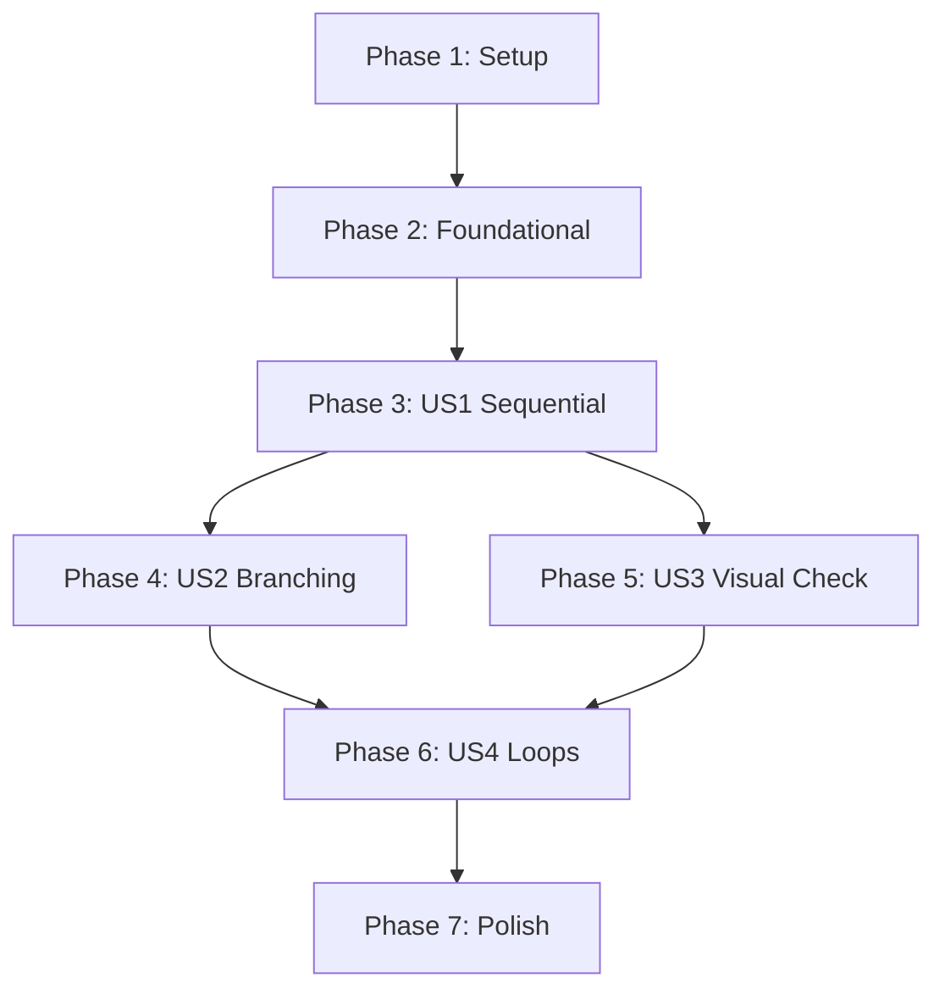

# Tasks: Visual Workflow Builder (VWB)

## Phase 1: Setup

- [x] T001 Add `vyuh_node_flow` and `value_notifier_tools` dependencies to `ui/pubspec.yaml`
- [x] T002 Create workflow feature directory structure in `ui/lib/features/workflow/`
- [x] T003 [P] Create empty test files for workflow logic in `ui/test/features/workflow/`

## Phase 2: Foundational

- [x] T004 Update Python engine response model to include `execution_details` (exit_code, stdout) in `engine/src/api/routes.py`
- [x] T005 [P] Define `Workflow` and `NodeData` sealed classes in `ui/lib/features/workflow/models/workflow_models.dart`
- [x] T006 Update `ApiClient` to parse enhanced execution results in `ui/lib/core/api_client.dart`
- [x] T007 Implement JSON serialization for `NodeData` and `Workflow` in `ui/lib/features/workflow/models/workflow_models.dart`

## Phase 3: [US1] Chaining Sequential Actions (Priority: P1)

**Goal**: Enable users to link multiple VDA actions and execute them in sequence.
**Independent Test**: Create a workflow with 3 sequential clicks and verify they all execute in order.

- [x] T008 [P] [US1] Create `WorkflowViewModel` extending `ChangeNotifier` in `ui/lib/features/workflow/view_models/workflow_view_model.dart`
- [x] T009 [P] [US1] Implement `WorkflowCanvas` using `NodeFlowEditor` in `ui/lib/features/workflow/widgets/workflow_canvas.dart`
- [x] T010 [US1] Implement sequential traversal logic in `WorkflowEngine` in `ui/lib/features/workflow/services/workflow_engine.dart`
- [x] T011 [P] [US1] Create `CommandRegistryPanel` for drag-and-drop of saved commands in `ui/lib/features/workflow/widgets/command_registry_panel.dart`
- [x] T029 [P] [US1] Implement `NodeParameterPanel` for configuring node-specific parameters (FR-005) in `ui/lib/features/workflow/widgets/node_parameter_panel.dart`
- [x] T012 [US1] Write tests then implement `VdaActionNode` execution in `WorkflowEngine` (Constitution III) in `ui/lib/features/workflow/services/workflow_engine.dart`
- [x] T013 [US1] Implement active node highlighting in the visual graph during execution in `ui/lib/features/workflow/widgets/workflow_canvas.dart`

## Phase 4: [US2] Multi-Outcome Conditional Branching (Priority: P2)

**Goal**: Allow workflows to follow different paths based on success, failure, or specific script results.
**Independent Test**: Create a branch that follows different paths for "Success" vs "Timeout".

- [x] T014 [P] [US2] Add `BranchNode` and `ConditionData` models in `ui/lib/features/workflow/models/workflow_models.dart`
- [x] T015 [US2] Implement branching logic in `WorkflowEngine` based on `lastResult` in `ui/lib/features/workflow/services/workflow_engine.dart`
- [x] T016 [US2] Update `NodeFlowEditor` node builder to support multi-outcome port labels for Branch nodes in `ui/lib/features/workflow/widgets/workflow_canvas.dart`

## Phase 5: [US3] Visual Existence Check (Priority: P2)

**Goal**: Check if an element is visible without performing an interaction.
**Independent Test**: Use a Visual Check node to branch based on an icon being present.

- [x] T017 Add non-destructive visual recognition endpoint (or parameter) in `engine/src/api/routes.py`
- [x] T018 [P] [US3] Add `VisualCheckNode` model in `ui/lib/features/workflow/models/workflow_models.dart`
- [x] T019 [US3] Implement `VisualCheckNode` execution in `WorkflowEngine` in `ui/lib/features/workflow/services/workflow_engine.dart`

## Phase 6: [US4] Iterative/Repetitive Execution (Priority: P3)

**Goal**: Repeat sequences of actions based on conditions.
**Independent Test**: Create a loop that clicks "Next" until a specific icon appears.

- [x] T020 [P] [US4] Add `LoopNode` model with termination conditions in `ui/lib/features/workflow/models/workflow_models.dart`
- [x] T021 [US4] Implement iterative execution logic (While/Repeat) in `WorkflowEngine` in `ui/lib/features/workflow/services/workflow_engine.dart`

## Phase 7: Polish & Cross-Cutting Concerns

- [x] T022 [P] Implement Undo/Redo for graph modifications using `value_notifier_tools` in `ui/lib/features/workflow/view_models/workflow_view_model.dart`
- [x] T023 [P] Implement continuous persistence to `draft_workflow.json` on graph changes in `ui/lib/features/workflow/services/workflow_persistence.dart`
- [x] T024 [P] Implement Export/Import of `.swflow` files in `ui/lib/features/workflow/services/workflow_persistence.dart`
- [x] T025 [P] Add execution stopwatch and elapsed time display in `ui/lib/features/workflow/widgets/workflow_toolbar.dart`
- [x] T026 [P] Implement node execution counters and display them on the canvas in `ui/lib/features/workflow/widgets/workflow_canvas.dart`
- [x] T027 [P] Ensure automatic persistence is triggered before the "Run" action starts in `ui/lib/features/workflow/view_models/workflow_view_model.dart`
- [x] T028 Implement "Stop" functionality to immediately halt the `WorkflowEngine` loop in `ui/lib/features/workflow/services/workflow_engine.dart`
- [x] T032 [P] Verify 60 FPS rendering and <100ms state update latency with a 50-node stress test workflow (SC-003, SC-004)
- [x] T033 [P] Conduct usability benchmark: Verify a user can create a 5-step sequential workflow in under 60 seconds (SC-001)

## Dependency Graph

## Parallel Execution Opportunities

- **T005, T008, T009**: Initial model and UI widgets can be developed in parallel once setup is done.
- **T011, T013**: UI components like side panels and highlighting can be worked on concurrently.
- **T014, T018, T020**: Adding different node models is generally parallelizable.
- **T022, T023, T024, T025, T026**: Most polish tasks are independent and can be handled in parallel.

## Implementation Strategy

1. **MVP (Phase 1-3)**: Deliver a basic builder that can link and run sequential VDA actions.
2. **Logic Expansion (Phase 4-6)**: Incrementally add branching, visual checks, and loops.
3. **Robustness (Phase 7)**: Add undo/redo, auto-save, and execution metrics to finalize the feature.
 visual checks, and loops.
3. **Robustness (Phase 7)**: Add undo/redo, auto-save, and execution metrics to finalize the feature.
