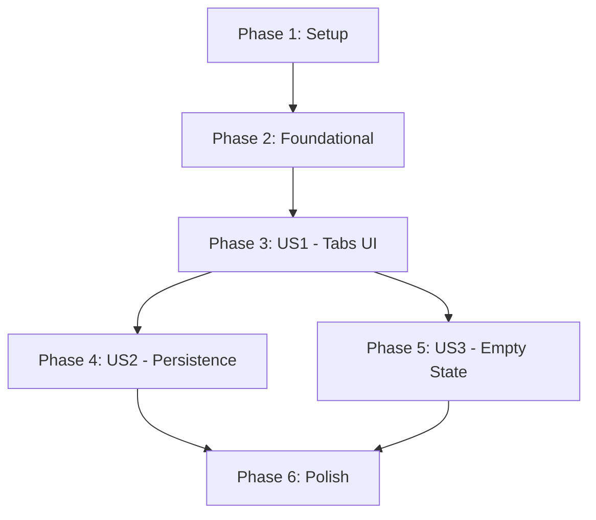

# Tasks: Multi-tab Workflows

**Feature**: Multi-tab Workflows
**Implementation Plan**: `specs/008-multi-tab-workflows/plan.md`

## Phase 1: Setup

- [X] T001 Create project structure for workspace management in `ui/lib/features/workflow/`
- [X] T002 Add `path_provider` dependency to `ui/pubspec.yaml`

## Phase 2: Foundational

- [X] T003 [P] Define `WorkspaceSession` and `TabMetadata` models in `ui/lib/features/workflow/models/workspace_models.dart`
- [X] T003.1 Create unit tests for SessionPersistenceService in `ui/test/features/workflow/services/session_persistence_service_test.dart`
- [X] T004 Implement `SessionPersistenceService` using the contract schema in `ui/lib/features/workflow/services/session_persistence_service.dart`

## Phase 3: User Story 1 - Multiple Open Workflows [US1]

**Goal**: Permit opening multiple workflow files in a browser-like tabbed interface.
**Test**: Open two `.swflow` files; verify two tabs appear and switching between them updates the editor.

- [X] T004.1 [US1] Create unit tests for WorkspaceViewModel in `ui/test/features/workflow/view_models/workspace_view_model_test.dart`
- [X] T004.2 [US1] Create widget tests for WorkflowTabBar and WorkflowTab in `ui/test/features/workflow/widgets/tab_widgets_test.dart`
- [X] T005 [P] [US1] Create `WorkspaceViewModel` to manage a list of `TabMetadata` in `ui/lib/features/workflow/view_models/workspace_view_model.dart`
- [X] T006 [US1] Refactor `WorkflowViewModel` to accept `filePath` and implement `saveToFile()` in `ui/lib/features/workflow/view_models/workflow_view_model.dart`
- [X] T007 [P] [US1] Create `WorkflowTab` widget with title and close button in `ui/lib/features/workflow/widgets/workflow_tab.dart`
- [X] T008 [P] [US1] Create `WorkflowTabBar` with scrollable horizontal list in `ui/lib/features/workflow/widgets/workflow_tab_bar.dart`
- [X] T009 [US1] Implement `openWorkflow` logic in `WorkspaceViewModel` including duplicate check (FR-009)
- [X] T010 [US1] Implement `closeTab` logic in `WorkspaceViewModel` including auto-save (FR-008) and focus shifting (FR-011)
- [X] T011 [US1] Update `WorkflowScreen` to integrate `WorkflowTabBar` and `WorkspaceViewModel` in `ui/lib/features/workflow/workflow_screen.dart`
- [X] T012 [US1] Implement drag-and-drop reordering in `WorkflowTabBar` (FR-010)
- [X] T013 [US1] Implement tab context menu (Close Others, Copy Path, etc.) in `WorkflowTab` (FR-012)

## Phase 4: User Story 2 - Startup Persistence [US2]

**Goal**: Automatically reload the last-worked workflow on application start.
**Test**: Open a workflow, restart the app, verify it reloads in a tab automatically.

- [X] T014 [US2] Implement session state persistence (last active path) in `WorkspaceViewModel`
- [X] T015 [US2] Implement session restoration logic in `WorkspaceViewModel` using `SessionPersistenceService`
- [X] T016 [US2] Update `main.dart` to provide `WorkspaceViewModel` and trigger restoration on launch

## Phase 5: User Story 3 - Empty State and First Run [US3]

**Goal**: Show a menu to open a workflow when no tabs are present.
**Test**: Close all tabs; verify the "Open Workflow" menu appears.

- [X] T017 [P] [US3] Create `EmptyWorkspaceView` widget in `ui/lib/features/workflow/widgets/empty_workspace_view.dart`
- [X] T018 [US3] Update `WorkflowScreen` to toggle between tabbed view and `EmptyWorkspaceView` (FR-005)
- [X] T018.1 [US3] Implement "Recently Open" menu in EmptyWorkspaceView and Main Menu (FR-013)

## Phase 6: Polish & Cross-Cutting Concerns

- [X] T019 Add visual indicator (dot/asterisk) for modified state (FR-014) in `WorkflowTab`
- [X] T020 Optimize tab switching performance to ensure < 200ms latency (SC-001)
- [X] T021 Ensure structured logging for all tab and session events (Constitution Principle IV)
- [X] T022 [US2] Benchmark application startup and session restoration to verify SC-002 (<2s) and SC-003

## Dependency Graph

## Parallel Execution Examples

### User Story 1 (Tabs UI)
- `T005` (ViewModel) and `T007`/`T008` (Widgets) can be developed in parallel after `T003` is done.
- `T006` (WorkflowViewModel refactor) is independent of UI tasks but required for `T010`.

### User Story 3 (Empty State)
- `T017` (Widget) can be developed independently of the main workspace logic.

## Implementation Strategy

1. **MVP (Phase 1-3)**: Focus on getting the tab bar working with multiple in-memory workflows. 
2. **Persistence (Phase 4)**: Add the ability to remember the last file.
3. **Refinement (Phase 5-6)**: Add the empty state and visual polish.
